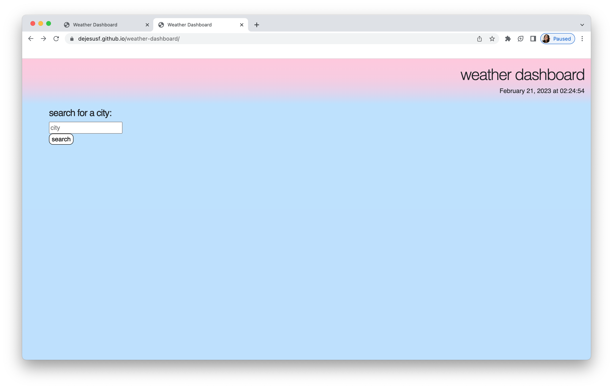

# Weather Dashboard

## Description

This assignment was based on third-party APIs. We were given a weather API and created a website that allows the user to search a city and then is provided with the current weather of that city as well as a 5 day forecast.

After getting used to fetch functions and APIs, I was able to successfully render cities at the click of a button.

## Website

Here is a screenshot of how the website looks like:

]

## Link

This is the [link](https://dejesusf.github.io/weather-dashboard/) to the deployed website.